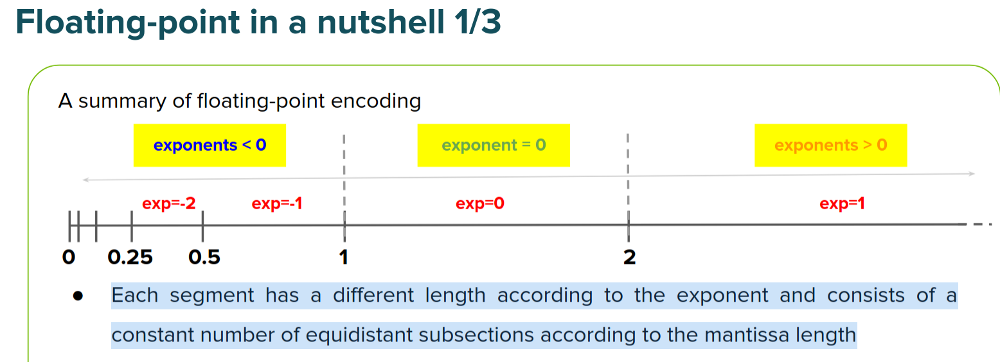

## Fixed-point representation
...

La maggior debolezza dei fixed point è che hanno range molto piccolo rispetto al floating point. Tuttavia, una caratteristica negativa del floating point è che l'errore di approssimazione cresce tanto più è grande il numero da rappresentare. I fixed point invece hanno un errore indipendente dalla rappresentazione del numero. Vedi in seguito.

## Floting-point representation
...

### Problemi di approssimazione nella rappresentazione dei reali

Il problema di fondo è che: **the number of available (binary) digits is limited**, and despite some lucky cases, many numerical values cannot be encoded
without approximation/rounding. __Increasing the number of binary digits__ can yield a better approximation but not solve the problem.

...

We get a much better approximation with 23 fractional bits, but we cannot encode exactly a simple numerical value like 1.21.

This evidence is the first critical aspect to consider when using floating-point: **most numbers are just a rounded approximation to the closest available encodable representation**.

Inoltre:

The distance between two encodable values increases with the magnitude of the numeric value (or better, according to the increase of its positive exponent). Consequently, the rounding error in the worst cases is higher with larger positive exponents because the weight of ULP gets higher (2x when the exp. increases by 1). 

On the other hand, the issue just highlighted is the side effect that allows encoding much higher numeric values with floating-point vs fixed-point.

### ULP (Unit in the Last Place)
Questa cifra da una indicazione sul grado di precisione possibile nella rapresentazione di un reale.

Questa cifra però ha un perso variabile in base alla mgnitudo del numero da rappresentare; per numeri grandi l'ULP verrà moltiplicato per l'esponente che in questo caso sarà grande. Per numeri piccoli l'ULP verrà moltiplicato per un esponente minore, e quindi si avrà una precisione maggiore.

...

Anche con float, quando si va verso dei numeri molto grandi, si perdono dei numeri interi che non si è più in grado di codificare. Questo è sempre dovuto al fatto che l'ULP viene modificato per l'esponente.

...

La soluzione è aumentare i bit della mantissa; ci sono però dei drawback
- la dimensione della mantissa è proporzionale con il quadrato dell'energia consumata
- proporzionale al tempo di calcolo.

### Grafico utile | Intervalli di valori rappresentabili con un determinato esponente in floating point

Maggiore è l'esponente e più grande l'intervallo, tuttavia il numero di bit della mantissa è costante e quindi l'intervallo viene diviso in sezioni via via più grandi. 

**NB**: Il grafico è specchiato per i numeri negativi

**NB_2**: occhio ai valori subnormali, they enable increased accuracy around zero

### Floating point additions 
...

Adding large values with smaller ones can induce errors due to the exponents' **alignment**