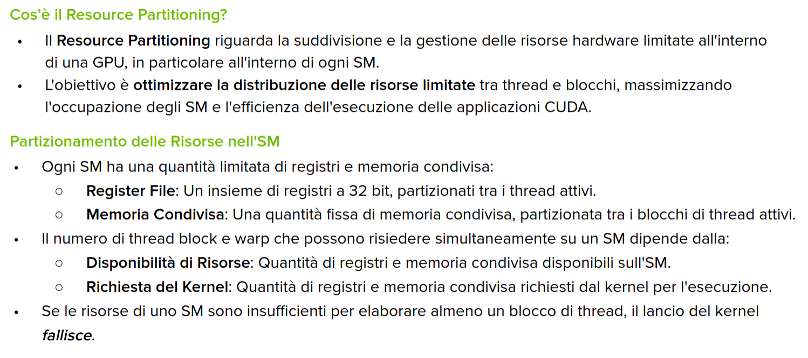

La ragione per cui si utilizza una GPU è per ottenere prestazioni elevate. Ciò implica sfruttare tutte le risorse disponibili, gestendo i __pattern di accesso alla memoria__ e un aspetto noto come __occupancy__.

### Resource Partitioning in CUDA

bello l'esempio di Resource Partitioning in CUDA ...

    Gestire le risorse è come un Tetris multidimensionale: non puoi raggiungere la perfezione, ma devi mirare al miglior incastro possibile

### Occupancy
L'occupancy rappresenta il grado di utilizzo delle risorse di calcolo dell'SM. L'occupancy è il rapporto tra i warp attivi e il numero massimo di warp supportati per SM (vedi compute capability):

    Occupancy [%] = Active Warps / Maximum Warps

...

#### Linee Guida per le Dimensioni di Griglia e Blocchi
- Mantenere il numero di thread per block __multiplo della dimensione del warp__ (32).
- __Evitare dimensioni di block piccole__: Iniziare con almeno 128 o 256 thread per block.
- Regolare la dimensione del blocco in base ai requisiti di risorse del kernel.
- Mantenere il numero di blocchi molto maggiore del numero di SM per esporre sufficiente parallelismo al dispositivo (__latency hiding__).
- Condurre esperimenti per scoprire la migliore configurazione di esecuzione e utilizzo delle risorse.