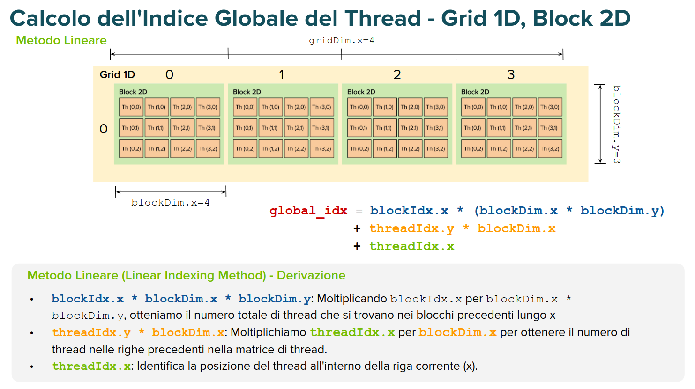
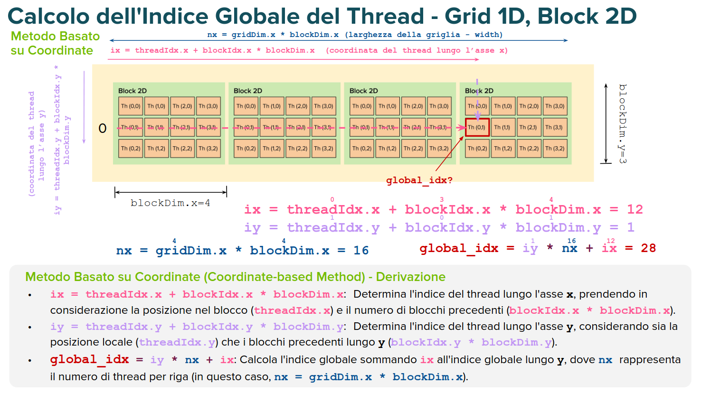
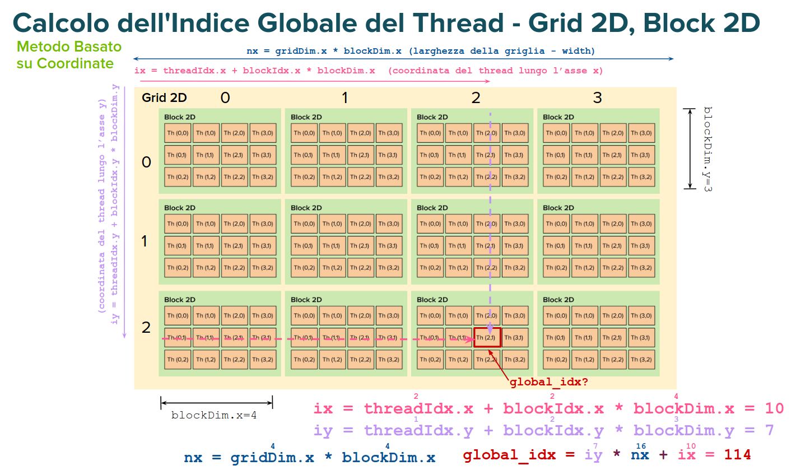

## Struttura dei Dati e Calcolo dell'Indice Globale
Anche le strutture più complesse, come matrici (2D) o array tridimensionali (3D), vengono memorizzate come una sequenza di elementi contigui in memoria nella GPU, tipicamente organizzati in array __lineari__.

Ogni thread elabora uno o più elementi di questi array basandosi sul suo __indice globale__.

Esistono diversi metodi per calcolare l'indice globale di un thread (es. Metodo Lineare, Coordinate-based). Metodi diversi possono produrre indici globali differenti per lo stesso thread (mapping diversi thread-dati), impattando le prestazioni (come la coalescenza degli accessi in memoria) e la leggibilità del codice.

## ESEMPIO GRIGLIA 1-D e BLOCCHI 1-D

    global_idx = blockIdx.x * blockDim.x + threadIdx.x;

    Con "blockIdx.x * blockDim.x" otteniamo il numero totale di
    thread che si trovano nei blocchi precedenti.

    "threadIdx.x" identifica la posizione del thread all'interno del
    blocco corrente (offset).

## ESEMPIO GRIGLIA 1-D e BLOCCHI 2-D (Metodo Lineare) 

## ESEMPIO GRIGLIA 1-D e BLOCCHI 2-D (Metodo per Coordinate) 

    Idea: considerare la griglia come una grossa matrice di thread, ignorando momentaneamente i blocchi. 

    ix = coordinata x (offset di riga)
    iy = coordinata y
    nx = numero di thread per riga
    iy*nx = numero thread nelle righe precedenti

    simile a come vengono salvate e indicizzate le matrici in memoria (riga per riga) .

## ESEMPIO GRIGLIA 2-D e BLOCCHI 2-D (Metodo Lineare) 

    Prima cerco di capire in che blocco sono, e poi la posizione all'interno del blocco.

    Comincia ad essere complicato.

## ESEMPIO GRIGLIA 2-D e BLOCCHI 2-D (Metodo per Coordinate) 

    Uguale a prima!

## IN CONCLUSIONE
Il metodo lineare, se si hanno dati multidimensionali, è meno intuitivo rispetto al metodo per coordinate. Per scegliere quale usare bisogna tenere conto in ogni caso della disposizione dei dati in memoria, in quanto in base alla scelta del metodo di indicizzamento si possono avere prestazioni diverse (vedremo avanti). 

    formule per tutti i casi riportate sulle slide.

## COME SI DEFINISCE LA DIMENSIONE DELLA GRIGLIA E DEI BLOCCHI? 
Approccio Generale
- Definire manualmente (ad occhio) prima la dimensione del blocco (cioè quanti thread per blocco).
    - In pratica, si scelgono __dimensioni multiple di 32__ per efficienza delle operazioni sulla GPU, dato che i warp (unità di esecuzione parallela della GPU) sono composti da 32 thread (lo analizzeremo in seguito nel dettaglio).
- Poi, calcolare automaticamente la dimensione della griglia in base ai dati e alla dimensione del blocco.
    - bisogna aggiustare il calcolo per ottenere un numero di blocchi "approssimato per eccesso rispetto" alla dimensione dei dati. 
        - ceil(data_size / block_size)

Motivazioni
- La dimensione del blocco è legata alle caratteristiche hardware della GPU e la natura del problema.
- La dimensione della griglia si adatta alla dimensione del blocco e al volume dei dati da processare

__NB__: il numero di thread totale deve essere maggiore uguale alla dimensione dei dati (un thread per dato) 
- data_size <= block_size * (data_size + (block_size-1))/block_size

__NB_2__: all'interno del kernel bisogna poi verificare gli indici
per escludere i thread appartenenti al blocco aggiuntivo fuori oltre data_size.

        