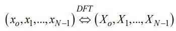
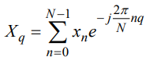
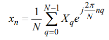
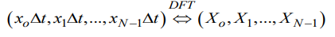
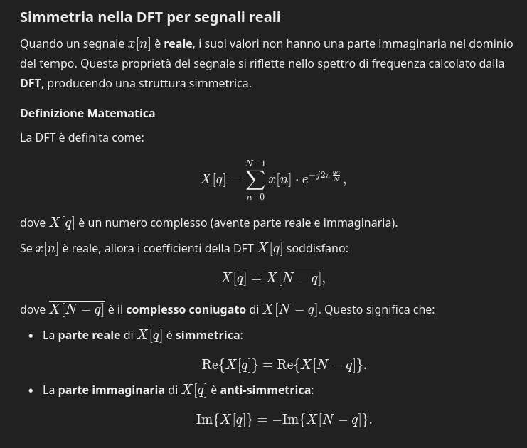
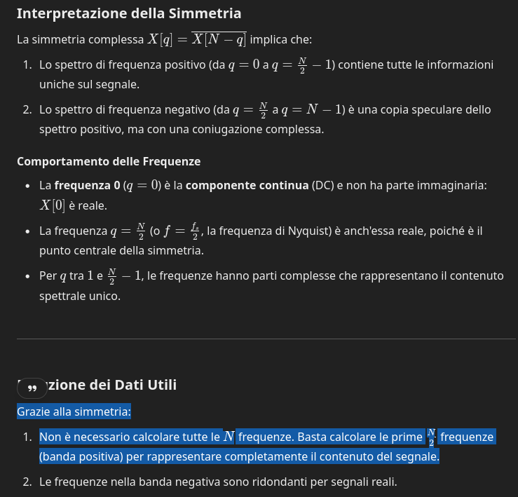

## DFT
Finora abbiamo visto trasformate di segnali (tempo-continui e tempo-discreti) che si estendono lungo tutto l'asse dei tempi dei tempi. Consideriamo ora un nuovo tipo di trasformata, detta trasformata di Fourier discreta (DFT=Discrete Fourier Transform), che si applica non più a una serie di infiniti termini ma ad una __n-pla, cioè ad un vettore, costituito in generale da componenti complesse__.

Più precisamente la DFT stabilisce una corrispondenza biunivoca fra due n-ple di numeri, in generale complessi (n-pla di partenza e di arrivo)

L’elemento __q-esimo__ dell’n-pla di arrivo è definito come (__formula di trasformazione__):

Si noti che i termini sono numerati a partire da 0 e di conseguenza la sommatoria iterna fino a N-1.

Si noti come questa formula assomigli alla __trasformata di una serie temporale__, a patto di:
- considerare un numero finito di termini
- di sostituire q ad w
- di sostituire 2*pi/N a T.

Si noti inoltre che questo singolo termine dipende da __tutti i termini della n-pla di partenza__ così come il valore della trasformata di un segnale tempo continuo ad una data pulsazione dipende da tutto il segnale di partenza.

La __formula di antitrasformazione__ (IDFT=Inverse Discrete Fourier Transform), che ci restituisce un termine della n-pla di partenza a partire da quella di arrivo è la seguente:

Anche qui l’analogia è abbastanza stretta. Si tratta come per tutte le antitrasformate di cambiare segno all’argomento dell’esponenziale, quindi di inserire un termine moltiplicativo. Questo era T/2π nell’antitrasformata delle serie temporali, qui è 1/N. Si noti che per passare dal primo al secondo è sufficiente sostituire 2*pi/N a T.

__NB__: Le formule di trasformazione ed antitrasformazione stabiliscono una corrispondenza biunivoca fra due n-ple ordinate mediante __prodotti e addizioni in numero finito__. Esse sono perciò direttamente __implementabili su un elaboratore elettronico__, diversamente dalle altre trasformate viste in precedenza che comportano il calcolo di integrali o di somme di serie.

### Legame fra trasformata di Fourier discreta e continua
La trasformata di Fourier discreta costituisce un elemento fondamentale dell’elaborazione digitale dei segnali (Digital Signal Processing).  Essa può in particolare essere utilizzata per __calcolare, in modo approssimato, la trasformata di Fourier di segnali tempo continui__ (mediante un numero di calcoli finito).

__NB__: La DFT assume che il segnale sia periodico con un periodo uguale alla lunghezza del campione ottenuto considerando il segnale in modo continuo dal primo campione all'ultimo. 

Sia dunque x(t) una funzione con trasformata X(w). Risulterebbe comodo che prendendo N campioni di x(t) ed eseguendo la DFT si ottenessero N campioni della trasformata X(w). Il legame è tuttavia più complesso, e riguarda le __ripetizioni periodiche di x(t) e di X(w)__. 

Seguono vari passaggi; in maniera superficiale:
- costruzione delle ripetizioni periodiche di x(t) e X(w) scegliendo con cura i periodi T_p e w_p
- definizione degli __intervalli di campionamento__ delta_t e delta_w con cui recuperare i campioni dalle ripetizioni periodiche.
- recupero dei campioni secondo gli intervalli definiti nel passo precedente

Moltiplichiamo quindi per delta_t la n-pla nei tempi; si può dimostrare che essa è legata alla n-pla nelle frequenze dalla trasformazione discreta di Fourier:

Il legame è quindi (a meno della costante delta_t) fra N campioni nei tempi ed N campioni nelle frequenze, __non di x(t) e X(w), ma delle loro ripetizioni periodiche__, costruite in un modo che sopra è stato omesso (in particolare i periodi delle ripetizioni periodiche devono essere legati fra loro dal numero di punti N)

__NB__: Quando i termini delle due ripetizioni non si sovrappongono in modo significativo, ovvero è __trascurabile l'aliasing sia nel dominio dei tempi che in quello delle frequenze__:

    Le N-ple nei tempi e nelle frequenze, in generale rappresentative delle ripetizioni periodiche, diventano rappresentative delle sole x(t) e X(W).

__Se ciò si verifica (Teorema di Shannon) la DFT può essere utilizzata per calcolare campioni della trasformata continua__.

Per evitare l’aliasing occorre assumere sia T_p che w_p sufficientemente grandi (distanziamo le ripetizioni periodiche), il che comporta la __scelta un numero di punti N sufficientemente elevato__. D'altra parte, ciò riduce i valori di delta_t e delta_w e favorisce quindi una conveniente risoluzione degli assi dei tempi e delle pulsazioni che riduce l'errore quando si andrà a recuperare la trasformata del segnale originale mediante __interpolazione__ dei punti ottenuti con la __DFT__.

__NB__: chiaramente i campioni della trasformata non sono disponibili fin da subito, essi si ottengono applicando la DFT e la relazione sopra ai campioni ottenuto dal segnale nel dominio del tempo.

## Simmetria per segnali reali
**Molto in breve**:
La DFT è simmetrica per segnali reali: solo le prime N/2​ frequenze (banda positiva) sono utili, e vanno da 0 a fs/2​​ (la frequenza di Nyquist). La seconda metà della DFT rappresenta le frequenze speculari (negative) e non contiene informazioni nuove per segnali reali.
- Frequenze da q=0q=0 a q=N2−1q=2N​−1 rappresentano la banda positiva.
- Frequenze da q=N2q=2N​ a q=N−1q=N−1 rappresentano la banda negativa (simmetrica).

**Più nel dettaglio**:

