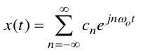
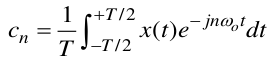
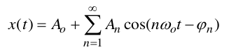

Lo sviluppo in serie si applica alle funzioni __tempo continue__ x(t), __continue o discrete nei valori__, __periodiche__ con periodo T.

- Forma esponenziale (segnali complessi)

Sotto alcune condizioni, che vedremo fra poco, la funzione x(t) può essere rappresentata come __somma di infiniti fasori__, aventi __pulsazioni multiple della pulsazione fondamentale__ w_0 = 2pi/T.

Formula di sintesi = __serie di Fourier__ (in forma esponenziale)

Formula di analisi:
- I __numeri complessi rappresentativi dei fasori__, cioè i “coefficienti” della serie di Fourier in forma esponenziale, sono dati dalla formula (di analisi)

### Per segnali reali esistono anche altre forme per la sintesi dello sviluppo in serie
Ad esempio:

Ci dicono però tutte la stessa cosa, ovvero che un __segnale periodico tempo continuo__ può essere scomposto in tante sinusoidi che hanno frequenza multipla della fondamentale.

//skip forma in seni e coseni
    