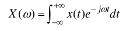
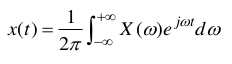
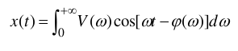

La trattazione vista in precedenza per i segnali periodici può essere __estesa ai segnali aperiodici__.

Consideriamo una funzione x(t), in generale complessa, aperiodica, tempo-continua. Sotto condizioni analoghe a quelle viste in precedenza per le serie di Fourier, esiste la __trasformata di Fourier__ (formula di analisi, dal dominio dei tempi a quello delle frequenze):

La cui formula di __antitrasformazione__ è data dalla seguente (formula di sintesi, cioè dalle frequenze ai
tempi) è:

### Integrale di Fourier
Come per il caso dello sviluppo in serie, __con i segnali reali__ si possono dare delle forme alternative, monolatere, alla formula di sintesi. Una di queste forme è chiamata integrale di fourier.

L’ integrale di Fourier è l’analogo dello sviluppo in serie in soli coseni; esso rappresenta x(t) come "somma" di infiniti termini sinusoidali, il generico dei quali ha:
- pulsazione w
- ampiezza(infinitesima) V(w)dw
- fase phi(w) .