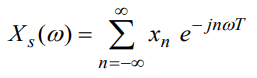
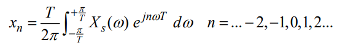
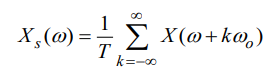
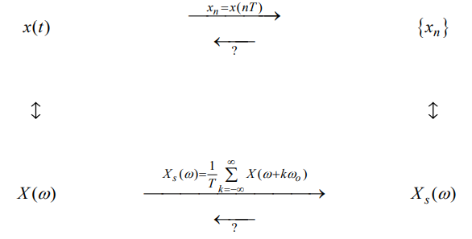

### Serie temporali
Le funzioni __tempo discrete__ sono anche chiamate serie temporali (__se formate da un numero infinito di termini__) od anche successioni o sequenze temporali. Esse possono rappresentare segnali che hanno già origine in tale forma oppure essere ottenute da una funzione tempo continua mediante lettura dei valori da essa assunti in istanti che si succedono con un intervallo T. Questa operazione è detta __campionamento__ e la corrispondente funzione tempo discreta è anche chiamata funzione campionata.

NB: non ci interessa sapere se la serie temporale sia continua o discreta nei valori.

## Trasformata di Fourier di una serie temporale
In modo analogo a quanto fatto per le funzioni tempo continue, sotto opportune condizioni, si può definire la __trasformata di Fourier della serie temporale__ mediante la seguente relazione:

Notare la somiglianza con la trasformata della funzione continua:
- sommatoria al posto dell'integrale
- n*T = t
- x_n al posto di x(t)

La __formula di antitrasformazione__, che dalla trasformata X_s(w) permette di ritornare agli elementi x_n della serie è la seguente:

Qua la somiglianza con la versione per funzioni continue dell'antrasformata non è immediata. Ma chissene...

### Relazione tra Trasformata della serie e trasformata della funzione campionata
Fra la __trasformata Xs(w) della serie__ e la __trasformata X(w) della funzione campionata__ vale la seguente
importantissima relazione, che lega la trasformata della serie alla __ripetizione periodica della trasformata del segnale__:

con w_0 = pulsazione di campionamento => ottenuta dalla frequenza di campionamento = f_0 = 1/T

## Teorema del campionamento nel dominio dei tempi (Shannon et alii)
Il campionamento trasforma un segnale tempo continuo in un segnale tempo discreto, cioè una serie temporale.

     Poniamoci ora il problema se e quando la conoscenza dei soli valori campionati è equivalente a quella dell’intero segnale tempo continuo.

cioè se e __quando il campionamento è reversibile__.

__Se non formuliamo alcuna condizione, la risposta è evidentemente negativa__ in quanto esistono infinite funzioni che negli istanti nT possono assumere i valori campionati xn. Se ne deve quindi dedurre che in generale l’operazione di campionamento è irreversibile, in quanto, sempre in generale, non è possibile ricostruire la funzione campionata dalla conoscenza dei suoi campioni.

__Questo tuttavia non vale sempre__, come si può vedere passando al dominio delle frequenze. Con riferimento alla figura sotto, si noti che dai valori campionati si può passare alla conoscenza della loro __trasformata X_s(w), che equivale alla conoscenza della ripetizione periodica di X(w)__ con periodo di ripetizione w_0 (pulsazione corrispondente alla frequenza di campionamento).

Come si vede dalla figura, se fosse possibile passare dalla ripetizione periodica a X(w), da questa si potrebbe risalire a x(t) antitrasformando. La domanda quindi diventa:

     è possibile risalire dalla ripetizione ad X(w)?
     
In generale no, ma, __se i termini della ripetizionoe sono non sovrapposti certamente sì__. 

    L'idea è cercare di invertire il passaggio sotto nel dominio delle frequenze e non direttamente quello sopra nel dominio del tempo

Come facciamo ad avere i termini della ripetizione non sovrapposti?

Aumentando la frequenza di campionamento, i termini della ripetizione si allontanano, fino a non sovrapporsi più quando __w_0 > 2*w_m__, o equivalentemente quando __f_0 > 2*f_m__. Si noti che in questo caso il modulo della ripetizione coincide con la somma dei moduli dei singoli termini, non essendo questi più sovrapposti.

In conclusione, l’enunciato del teorema di campionamento nei tempi è il seguente:

    Dato un segnale passa-basso, condizione sufficiente perché la conoscenza dei valori campionati sia equivalente alla conoscenza della funzione campionata x(t) è che la frequenza di campionamento sia maggiore del doppio della massima frequenza di x(t).
 
La metà della frequenza di campionamento è detta __frequenza di Nyquist__, e rappresenta il __limite superiore delle frequenze__ di un segnale passa-basso rappresentabili con una determinata frequenza di campionamento.

Il teorema di campionamento può essere esteso a segnali passa-banda. In questo caso, nella condizione è sufficiente sostituire alla frequenza massima del segnale la sua __larghezza di banda__.

## Sviluppo in serie di Shannon
Sotto la condizione sufficiente del teorema di Shannon, w_0 > 2*w_m , vogliamo ora esprimere x(t) in funzione dei suoi valori campionati x(nT).

Svolgendo i calcoli arriviamo ad una formula che non ci interessa. 

È importante sottolineare che il teorema del campionamento nel dominio dei tempi consente di sostituire ad una funzione tempo-continua una serie temporale __conservando tutto il contenuto informativo originario__. L'operazione di campionamento, eseguita nel rispetto delle ipotesi di tale teorema, costituisce, come vedremo, il primo passo per la conversione di un segnale analogico in forma numerica (conversione analogico/digitale o conversione A/D).