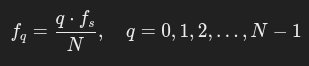

## Studio delle frequenze prodotte dalla DFT
Le frequenze *f_q* associate ai coefficienti *q* prodotti dalla DFT sono:



con:
- *q* : indice della componente nella N-upla della DFT (q va da 0 a N-1)
- *f_s* : frequenza di campionamento del segnale nel dominio dei tempi
- *N* : numero di campioni

**Esempio**: Nel caso di DFT di un file .wav di durata pari a 1s, campionato a 44,1 kHz (N = 44100), si stanno considerando le frequenze intere *q*.

Un altro modo di vederla è considerare la **risoluzione in frequenza**:


questo valore mostra i salti che si fanno a partire dal primo campione a 0Hz (nell'esempio precedente questo valore era proprio 1Hz) 

**NB**: Se il segnale contiene, ad esempio, le tre frequenze: 300 Hz, 400 Hz e 500 Hz, la DFT non farà un errore grosso a patto che la frequenza di campionamento sia abbastanza alta. La DFT potrebbe non essere in grado di rappresentare con precisione queste frequenze se non corrispondono esattamente ai "**bin**" della DFT (frequenze calcolate da q⋅fs/N​​).


### Come si ottiene la formula
Vediamo come si arriva alla relazione **_fq = q⋅fs/N_** a partire dalla definizione della DFT con i fasori. 

Il termine che ci interessa studiare è l'argomento del fasore: **_2π/N*nq_**; esso è un angolo in radianti che rappresenta una rotazione ciclica nella N-upla complessa.

**Interpretazione in termini di frequenza**:

Per capire la relazione tra q e le frequenze fq, consideriamo quanto segue:

1. Frequenza del campionamento *fs​*: Il segnale *x[n]* è stato campionato a una frequenza di campionamento *fs*. Questo significa che **ogni campione *n* rappresenta un istante temporale**:

    ```
    t_n = n*fs
    ```

2. Nell'argomento del fasore, il fattore **_q*n/N_**, rappresenta la frazione del ciclo completo (2π) percorsa dal fasore.

... VABBÈ, FIDATI ...